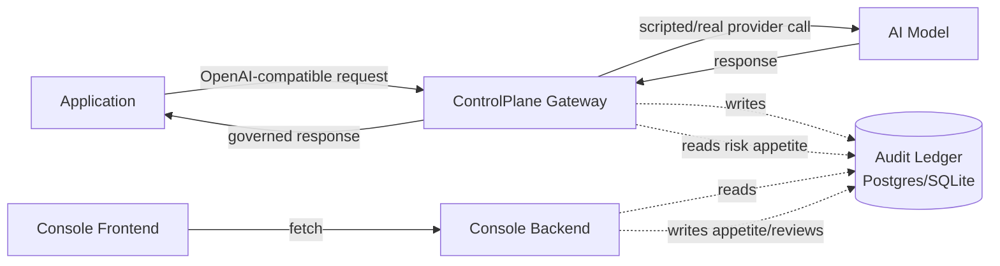
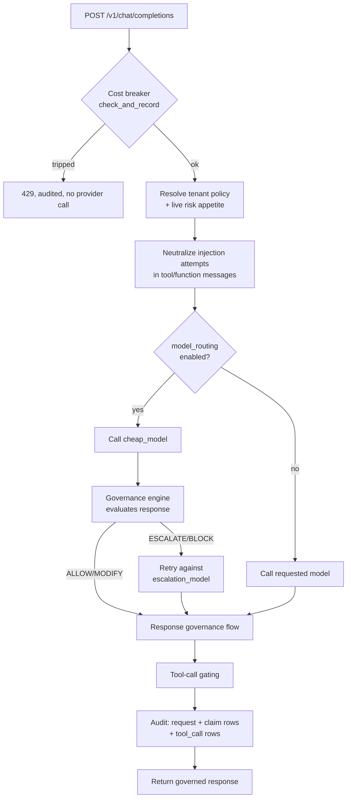
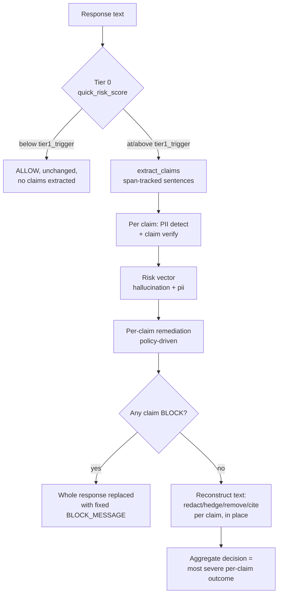
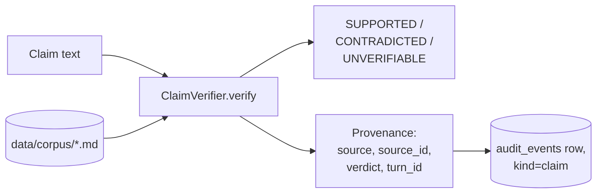
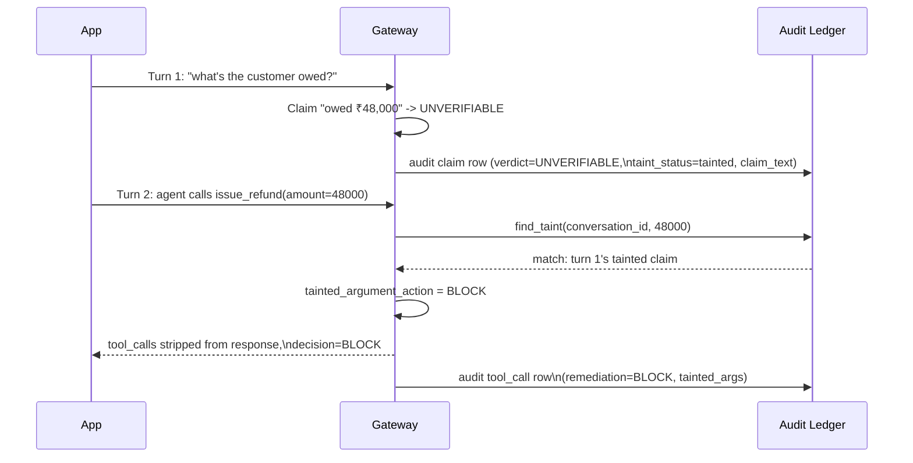
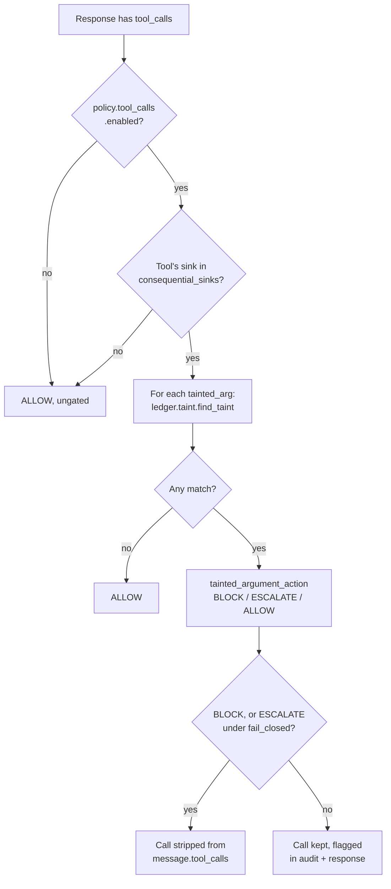

# Architecture

## System overview

The gateway (`gateway/`) and the console (`console/backend/`) are
deliberately separate processes sharing one database — an introspection
surface has no business running in the same process as the thing being
introspected, and the console needs write access for two narrowly-scoped
admin actions (risk appetite, human review) that the gateway itself never
needs.

## Request flow

Cost breaker → tenant/appetite resolution → input-side injection
neutralization → model call (with optional cheap-model reroute) →
response governance → tool-call gating → audit → response, in that order.
Each stage can short-circuit the rest (a tripped breaker never calls the
provider; a `ProviderError` skips straight to the audited-error response).

## Response (claim) flow

This is Phase 2's core mechanism (`policy/engine.py:GovernanceEngine`).
The "surgical" property comes from step J: claims are processed by their
original character spans, so only the flagged sentence changes — the rest
of the response is copied through untouched.

## Provenance flow

Every claim's provenance names *where its verdict came from* — a specific
corpus document (`source=retrieved_doc`, `source_id=<doc>`) or nothing
found (`source=model_prior`). `turn_id` is the count of user-role
messages in the request (`gateway/routes/chat.py:_turn_id`) — computed
statelessly per request, since an OpenAI-style client resends full
conversation history on every call, so there's no session store to keep
in sync.

## Taint flow (Scene 7)

A claim is tainted the moment its verdict isn't `SUPPORTED`
(`policy/engine.py`). Taint propagation isn't a separate datastore — `ledger/taint.py`
queries the same hash-chained `audit_events` table the gateway already
writes to (`claim_text` was added to the schema specifically so there's
something to match a later argument against), matching on the underlying
number regardless of currency/comma formatting. No second, unaudited way
to track what's trustworthy (`CLAUDE.md` rule #5).

## Tool-call flow (Scene 7, general case)

Sink classification (`data/tools.yaml` + `policy/tools.py`) is shared
across tenants — a tool's nature doesn't change per tenant. What differs
per tenant is whether a sink is *consequential for them* and what happens
on a tainted argument, both in `policy.tool_calls`.

## Audit ledger shape

One append-only, hash-chained table (`ledger/models.py:AuditEvent`),
discriminated by an explicit `kind` column rather than inferring row type
from which fields happen to be populated (added in Phase 4 after a real
collision: request rows carrying model-routing info and tool_call rows
both populate `action`, so that field alone couldn't tell them apart):

| `kind` | One row per | Key fields |
|---|---|---|
| `request` | gateway call | `decision`, `latency_ms`, `action` (model routing / injection info) |
| `claim` | extracted claim | `claim_id`, `claim_text`, `verdict`, `risk_labels`, `provenance`, `taint_status`, `remediation` |
| `tool_call` | gated `tool_calls` entry | `remediation`, `action` (tool_name/sink/tainted_args) |
| `risk_appetite_change` | console appetite write | `action` (old/new appetite, updated_by) |
| `human_review` | console review submission | `action` (reviewed_request_id/claim_id/decision, reviewer, agree, notes) |

`ledger/audit.py`'s `hash` commits to the previous row's hash plus the
row's own canonical field values — `verify_chain()` recomputes the whole
chain and catches any retroactive edit, used by every integration test
that touches the ledger and available to the console for a future
integrity view.

## Not yet built

The React console and everything under `bench/`/`demo/` all exist and
work (Phase 4/5). What's genuinely not implemented: Tier 2 deep
verification, and a production deployment topology (this describes one
gateway process + one console process against one database — no load
balancing, no multi-region, no Redis-backed shared state for the cost
breaker). See `docs/assumptions.md` for the full list.
